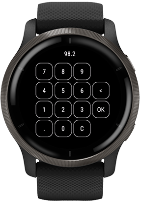

# Touch Keypad for Garmin

This is a barrel that can be used to push a view of a numpad and return the
picked number when pressing OK. Basically just a fancy number picker with some
settings to fit your needs.



## Usage

Here's a complete example app using the barrel. Use VS Code's feature to add a
barrel, or if you for some reason do this manually edit `barrels.jungle` so it
contains:

```text
TouchKeypad = [c:\path\to\garmin-touch-keypad\monkey.jungle]
base.barrelPath = $(base.barrelPath);$(TouchKeypad)
```

```monkeyc
import Toybox.Lang;
import Toybox.WatchUi;

import TouchKeypad;

class myDelegate extends WatchUi.BehaviorDelegate {
    function initialize() {
        BehaviorDelegate.initialize();
    }

    function onMenu() as Boolean {
        var view = new NumpadView({
            :callback => method(:myCallback),
            :input => "98.2",
            :separator => ".",
            :separatorLimit => 1,
        });
        var delegate = new NumpadDelegate(view);

        WatchUi.pushView(view, delegate, WatchUi.SLIDE_UP);

        return true;
    }

    function myCallback(input as String) as Void {
        System.println("Got input " + input);
    }
}
```

### Settings

| Setting           | Type                              | Description                                              |
| ----------------- | --------------------------------- | -------------------------------------------------------- |
| `:callback`       | `Method(value as Float) as Void ` | The method to call when pressing OK (default `null`)     |
| `:input`          | `String`                          | Starting input value (default `""`)                      |
| `:separator`      | `String`                          | The separator to use on the keypad (default `.`)         |
| `:separatorLimit` | `Number`                          | Max occurrances of the specified separator (default `1`) |
| `:vibrate`        | `Boolean`                         | Vibrate on each key tap (default `true`)                 |
